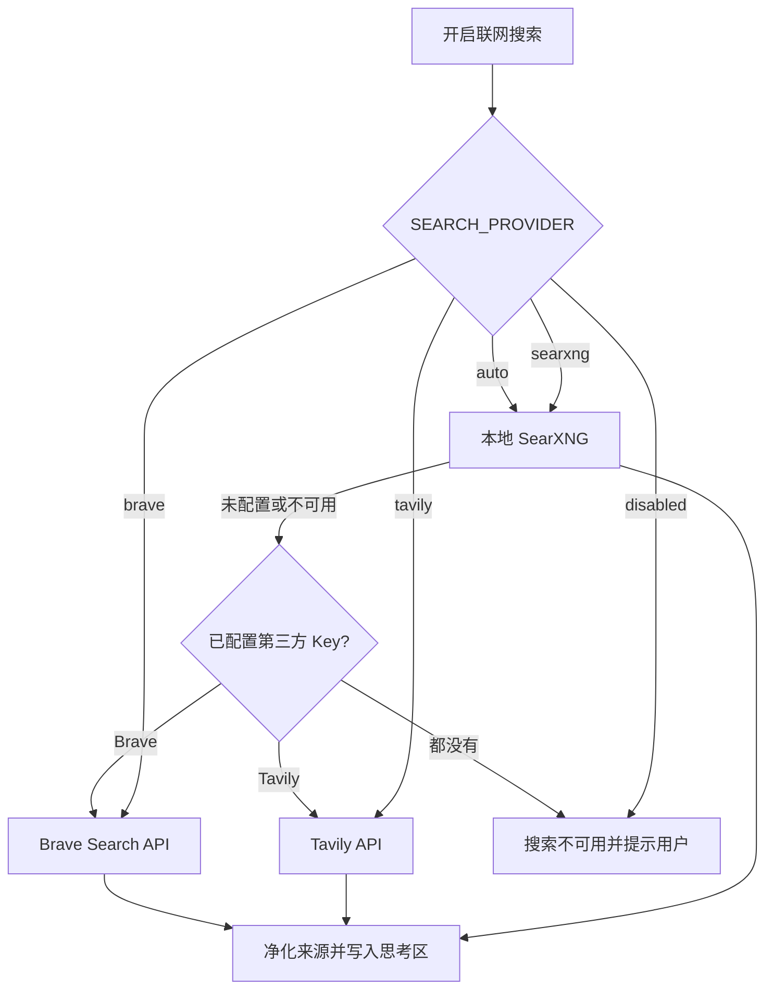

# AI 大模型接入指南

## 概览

后端通过统一的 OpenAI 兼容接口对接多家模型提供商。**只配置你需要的 Key 即可**——未填写 Key 的模型不会出现在前端模型选择列表中。

| 模型 ID                      | 名称              | 提供商    | 获取 Key                                                             |
| ---------------------------- | ----------------- | --------- | -------------------------------------------------------------------- |
| `deepseek-v4-flash`          | DeepSeek V4 Flash | DeepSeek  | [platform.deepseek.com](https://platform.deepseek.com/api_keys)      |
| `deepseek-v4-pro`            | DeepSeek V4 Pro   | DeepSeek  | [platform.deepseek.com](https://platform.deepseek.com/api_keys)      |
| `gpt-4o`                     | GPT-4o            | OpenAI    | [platform.openai.com](https://platform.openai.com/api-keys)          |
| `claude-3-5-sonnet-20241022` | Claude 3.5 Sonnet | Anthropic | [console.anthropic.com](https://console.anthropic.com/settings/keys) |

音乐生成不属于文本模型列表，使用独立的 ElevenLabs Music API。获取 Key、配置、三端使用
方式和真实验收边界见[媒体生成与音乐配置](media-generation.md)。

---

## 快速配置（以 DeepSeek 为例）

### 1. 复制环境变量模板

```bash
cp backend/.env.example backend/.env
```

### 2. 填写 API Key

编辑 `backend/.env`，将 `DEEPSEEK_API_KEY=` 后面填入你的 Key：

```bash
DEEPSEEK_API_KEY=sk-xxxxxxxxxxxxxxxxxxxxxxxxxxxxxxxx
```

其他提供商的 Key 留空即可，不会影响系统运行。

### 3. 启动后端并验证

```bash
cd backend
uv run uvicorn app.main:app --reload --port 8000
```

访问 [http://localhost:8000/docs](http://localhost:8000/docs)，在 `/api/v1/models` 接口（需先调 `/auth/login` 获取 token）可以确认 DeepSeek 已出现在模型列表中。

---

## 同时配置多个提供商

在 `backend/.env` 中填写多个 Key，系统会把所有已配置的模型都暴露给前端：

```bash
DEEPSEEK_API_KEY=sk-xxxxxxxxxxxxxxxx
OPENAI_API_KEY=sk-proj-xxxxxxxxxxxxxxxx
ANTHROPIC_API_KEY=sk-ant-xxxxxxxxxxxxxxxx
```

## 联网搜索

聊天输入区的“联网搜索”开关会把搜索结果放在该条回答的“思考”内容中：折叠时只保留
工具状态，展开后可以查看来源标题、摘要和链接，来源不会混入回答正文。搜索工具支持
`auto`、`searxng`、`brave`、`tavily` 和 `disabled` 五种模式。



### 默认无密钥方案：SearXNG

SearXNG 运行在本地 Docker 容器中，不需要第三方 API Key。首次启动前执行：

```bash
pnpm setup:search
docker compose up -d searxng
```

`pnpm setup:search` 只在根目录 `.env` 生成随机的 `SEARXNG_SECRET`；它不会生成、
读取或上传任何第三方账号凭据。`SEARCH_PROVIDER=auto`（默认）会优先使用
`http://127.0.0.1:8082` 的本地实例。

### Brave Search

1. 打开 [Brave Search API Keys](https://api.search.brave.com/app/keys) 并登录。
2. 创建一个 Search API Key，复制后只写入被 Git 忽略的 `backend/.env`。
3. 设置：

   ```dotenv
   SEARCH_PROVIDER=brave
   BRAVE_SEARCH_API_KEY=你的BraveKey
   ```

### Tavily

1. 打开 [Tavily Dashboard](https://app.tavily.com/home) 并登录。
2. 创建或复制 API Key，写入被 Git 忽略的 `backend/.env`。
3. 设置：

   ```dotenv
   SEARCH_PROVIDER=tavily
   TAVILY_API_KEY=你的TavilyKey
   ```

### 代理（可选）

搜索默认直接联网，不假设用户存在代理。只有本机网络确实需要代理时，才在仓库根目录
`.env` 显式设置 `SEARXNG_PROXY_URL`，例如：

```dotenv
SEARXNG_PROXY_URL=http://127.0.0.1:<你的代理端口>
```

没有代理或代理端口不一致的用户应保持该变量为空；不要把代理地址写入源码、提交或
`backend/.env.example`。代理只传给 SearXNG Docker 服务，Brave/Tavily 通过其自身
HTTPS 接口访问。

搜索结果会做 HTTPS、凭据、查询串/片段、长度和重复来源校验，并按用户限流和缓存；
搜索 provider 故障不会把原始 provider 响应直接展示给模型或客户端。

**默认模型**：模型列表中第一个被标记为默认模型，优先级顺序为：DeepSeek → OpenAI → Anthropic（按 `ai_service.py` 中 `AVAILABLE_MODELS` 的声明顺序）。

---

## 各提供商账号注册

### DeepSeek（推荐入门）

1. 注册：[platform.deepseek.com](https://platform.deepseek.com)
2. 左侧菜单 → **API Keys** → **Create new secret key**
3. 复制 `sk-` 开头的 Key 填入 `DEEPSEEK_API_KEY`

> DeepSeek V4 性价比极高。

### OpenAI

1. 注册：[platform.openai.com](https://platform.openai.com)
2. 右上角头像 → **API keys** → **Create new secret key**
3. 复制 `sk-proj-` 开头的 Key 填入 `OPENAI_API_KEY`

> 需绑定付款方式（信用卡）才能使用 GPT-4o。

### Anthropic (Claude)

1. 注册：[console.anthropic.com](https://console.anthropic.com)
2. **Settings** → **API Keys** → **Create Key**
3. 复制 `sk-ant-` 开头的 Key 填入 `ANTHROPIC_API_KEY`

---

## 新增模型

如需添加其他模型（如 `deepseek-reasoner`、`gpt-4o-mini` 等），编辑 `backend/app/services/ai_service.py`：

### 步骤一：在 `PROVIDER_CONFIG` 中添加路由

```python
PROVIDER_CONFIG: dict[str, dict[str, str]] = {
    # 已有条目...
    "deepseek-reasoner": {
        "provider": "deepseek",
        "base_url": "https://api.deepseek.com",
    },
}
```

### 步骤二：在 `AVAILABLE_MODELS` 中添加元数据

```python
AVAILABLE_MODELS = [
    # 已有条目...
    {
        "id": "deepseek-reasoner",
        "name": "DeepSeek R1",
        "provider": "deepseek",
        "description": "DeepSeek 推理增强模型",
        "supports_vision": False,
        "supports_files": False,
        "context_length": 64000,
        "is_default": False,
    },
]
```

只要 `provider` 与 `API_KEYS` 中的 key 匹配，且对应 Key 已填写，模型就会自动出现在前端列表中。

---

## 常见问题

**Q: 填了 Key 但前端看不到模型**

检查：

1. `backend/.env` 中 Key 已填写且无前后空格
2. 后端已重启（环境变量在启动时读取，修改后需重启）
3. Key 是否有效（在提供商控制台确认账户余额 / 配额）

**Q: 调用时报 `401 Unauthorized` 或 `402`**

- `401`：Key 填错或已失效，在对应平台重新生成
- `402`：账户余额不足，需充值

**Q: 想关闭某个模型，但不删 Key**

暂不支持单独禁用某个模型，临时方案是将 Key 置空（`OPENAI_API_KEY=`）后重启后端。

**Q: 流式输出（打字机效果）没有效果**

确认请求到达的是 `POST /api/v1/chat/stream` 而非 `/chat/completions`，前者才是 SSE 流式接口。
