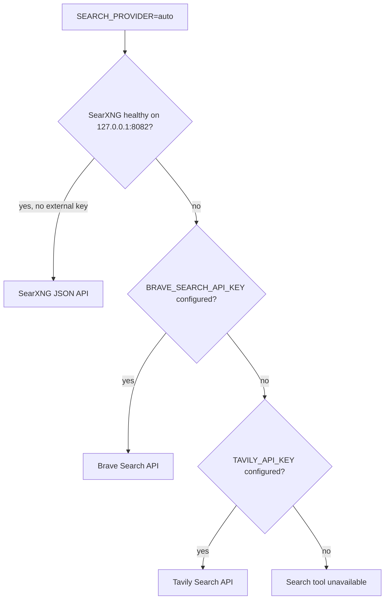

# Configurable Web Search Implementation Plan

> **For agentic workers:** REQUIRED SUB-SKILL: Use superpowers:subagent-driven-development (recommended) or superpowers:executing-plans to implement this plan task-by-task. Steps use checkbox (`- [ ]`) syntax for tracking.

**Goal:** Give chat models a safe, observable web-search tool that works with a no-external-key self-hosted SearXNG default and can fall back to Brave or Tavily when explicitly configured, while showing saved sources on Web, Desktop, and Mobile.

**Architecture:** The backend resolves one provider per process in the deterministic order SearXNG, Brave, then Tavily for `auto`; an explicit provider never silently changes to another one. A search service validates/caches/rate-limits queries, and `ai_service.py` runs a two-round maximum OpenAI-compatible tool loop. Search calls stream through the existing SSE event names, persist sanitized source metadata on the assistant message, and hydrate the existing `ToolCallRow` components after reload.

**Tech Stack:** FastAPI, async SQLAlchemy/Alembic JSON metadata, Redis, httpx, OpenAI-compatible tool calling, SearXNG JSON Search API, Brave Search API, Tavily Search API, Docker Compose, React/Next.js, Electron, Expo, TanStack Query, Vitest, pytest.

## Global Constraints

- `SEARCH_PROVIDER` accepts exactly `auto`, `searxng`, `brave`, `tavily`, or `disabled`; `auto` chooses the first healthy provider in SearXNG → Brave → Tavily order.
- Self-hosted SearXNG is the no-external-API-key default. Its local service secret is generated by a repository Node script into ignored local environment state; it is never committed or shown in logs.
- SearXNG uses the exact Compose image `ghcr.io/searxng/searxng:2026.8.14-094c33d40@sha256:892cf809341915a4b7710d3c9045005b4c377d51335a089b6d4da0b28750788d`; no floating tags are permitted.
- Brave and Tavily remain optional paid/free-tier providers. Their API keys exist only in ignored `backend/.env`; examples contain blank values.
- All provider traffic, query validation, tool calls, caching, and rate limiting stay in backend services. Clients never receive an API key or provider raw response.
- Do not scrape public search-result HTML or depend on public SearXNG instances; they can disable JSON and are not a stable product dependency.
- Search results are restricted to five HTTPS sources per call; untrusted title/snippet text is truncated, control characters removed, and treated as data rather than instructions.
- Tool execution is available only when a healthy provider is configured and the request opts in with `enable_web_search=true`. If unavailable, no tool schema is sent to the model and clients render the toggle disabled with an explanation.
- Limit a user to 10 opted-in searches per rolling minute, cache normalized queries for 5 minutes in Redis, set an 8-second provider timeout, and bound a model response to two tool rounds / two calls total.
- Preserve the existing SSE event names `tool_call_start`, `tool_call_delta`, and `tool_call_end`; add typed `sources` only to the end payload.
- Use package scripts for tests and real UI validation. Do not push or merge to `dev`. Complete the feature as one local `feat` commit, then delete the completed root task list in its own local `chore` commit.

## File Structure

| Path                                                                                                                   | Responsibility                                                                                                |
| ---------------------------------------------------------------------------------------------------------------------- | ------------------------------------------------------------------------------------------------------------- |
| `infra/searxng/settings.yml`                                                                                           | Minimal private SearXNG configuration with JSON results enabled and safe search enabled.                      |
| `scripts/ensure-searxng-secret.mjs`                                                                                    | Cross-platform generation/reuse of an ignored local SearXNG service secret.                                   |
| `scripts/dev.mjs`, `scripts/dev-mobile.mjs`, `docker-compose.yml`                                                      | Starts the pinned local SearXNG service before real API clients run.                                          |
| `backend/app/core/config.py`, `backend/.env.example`                                                                   | Provider selection, endpoint, key, timeout, cache, and rate-limit settings.                                   |
| `backend/app/services/tools/search.py`                                                                                 | Provider protocol, SearXNG/Brave/Tavily adapters, validation, Redis cache/rate limit, and availability check. |
| `backend/app/services/ai_service.py`                                                                                   | Bounded model tool-call loop and normalized tool events.                                                      |
| `backend/app/models/message.py`, `backend/alembic/versions/c7e8f9a0b1c2_add_message_tool_calls.py`, schemas, `chat.py` | Durable JSON metadata for completed tool calls and request feature flag.                                      |
| `packages/types/src/index.ts`, `packages/core/src/streams/conversation-stream-registry.ts`                             | Source metadata types, SSE parsing, and persisted message hydration.                                          |
| `apps/*/.../ToolCallRow.*`                                                                                             | Safe clickable source rows in the existing tool-call surfaces.                                                |
| `docs/ai-providers.md`, `docs/dev-guide.md`, `docs/troubleshooting.md`                                                 | Selection guide, key acquisition instructions, SearXNG setup diagram, and operational failures.               |

---

### Task 1: Add deterministic provider configuration and key-free SearXNG development service

**Files:**

- Create: `infra/searxng/settings.yml`
- Create: `scripts/ensure-searxng-secret.mjs`
- Modify: `docker-compose.yml`
- Modify: `scripts/dev.mjs`
- Modify: `scripts/dev-mobile.mjs`
- Modify: `backend/app/core/config.py`
- Modify: `backend/.env.example`
- Create: `backend/tests/unit/test_search_config.py`
- Modify: `docs/ai-providers.md`
- Modify: `docs/dev-guide.md`

**Interfaces:**

```python
SearchProviderName = Literal["auto", "searxng", "brave", "tavily", "disabled"]

class SearchSettings(BaseModel):
    provider: SearchProviderName
    searxng_base_url: str
    brave_api_key: str
    tavily_api_key: str
    timeout_seconds: float
    max_results: int
    cache_ttl_seconds: int
    per_user_limit_per_minute: int
```

```typescript
export interface SearchCapability {
  enabled: boolean
  provider: 'searxng' | 'brave' | 'tavily' | null
  reason: 'disabled' | 'unavailable' | null
}
```

- [ ] **Step 1: Write failing configuration and script tests**

```python
def test_auto_configuration_prioritizes_healthy_searxng() -> None:
    resolved = resolve_search_provider(
        settings=make_search_settings(provider="auto", searxng_base_url="http://127.0.0.1:8082", brave_api_key="brave", tavily_api_key="tavily"),
        health={"searxng": True, "brave": True, "tavily": True},
    )
    assert resolved.name == "searxng"

def test_explicit_brave_does_not_fall_back_to_tavily() -> None:
    assert resolve_search_provider(settings=make_search_settings(provider="brave", brave_api_key="", tavily_api_key="tavily"), health={}).reason == "unavailable"
```

```javascript
assert.match(await readFile(localEnv, 'utf8'), /^SEARXNG_SECRET=[a-f0-9]{64}$/m)
assert.equal((await readFile(localEnv, 'utf8')).match(/^SEARXNG_SECRET=/gm)?.length, 1)
```

- [ ] **Step 2: Run the focused checks and verify they fail**

Run:

```bash
cd backend && uv run pytest tests/unit/test_search_config.py -q
node --test scripts/ensure-searxng-secret.test.mjs
```

Expected: FAIL because no search configuration resolver or secret script exists.

- [ ] **Step 3: Add pinned SearXNG infrastructure without an external search key**

Create `infra/searxng/settings.yml` with JSON enabled and no public reverse proxy. The service is bound only to loopback port `8082`, while its container listens on `8080`. SearXNG's supported `SEARXNG_SECRET` environment override replaces the committed placeholder at container startup:

```yaml
use_default_settings: true
server:
  bind_address: '0.0.0.0'
  port: 8080
  secret_key: 'ultrasecretkey'
search:
  formats:
    - html
    - json
  safe_search: 2
```

Add this exact Compose service, preserving the existing pinned services unchanged:

```yaml
searxng:
  image: ghcr.io/searxng/searxng:2026.8.14-094c33d40@sha256:892cf809341915a4b7710d3c9045005b4c377d51335a089b6d4da0b28750788d
  environment:
    SEARXNG_SECRET: ${SEARXNG_SECRET:?run pnpm setup:search first}
  ports:
    - '127.0.0.1:8082:8080'
  volumes:
    - ./infra/searxng/settings.yml:/etc/searxng/settings.yml:ro
  restart: unless-stopped
```

`ensure-searxng-secret.mjs` must generate a 32-byte hex secret with `crypto.randomBytes`, write it only to ignored root `.env`, preserve every existing line, and refuse to overwrite a malformed existing `SEARXNG_SECRET`. Add `"setup:search": "node scripts/ensure-searxng-secret.mjs"`; `pnpm dev:real` and `pnpm dev:mobile` call that script before `docker compose up -d`.

- [ ] **Step 4: Add backend configuration and explicit provider semantics**

Add these values with safe defaults:

```dotenv
SEARCH_PROVIDER=auto
SEARXNG_BASE_URL=http://127.0.0.1:8082
BRAVE_SEARCH_API_KEY=
TAVILY_API_KEY=
WEB_SEARCH_TIMEOUT_SECONDS=8
WEB_SEARCH_MAX_RESULTS=5
WEB_SEARCH_CACHE_TTL_SECONDS=300
WEB_SEARCH_PER_USER_LIMIT_PER_MINUTE=10
```

Reject URLs containing credentials, query strings, fragments, a non-HTTP scheme, or a non-loopback `http` endpoint. `auto` tries healthy SearXNG, then configured Brave, then configured Tavily; an explicit provider returns unavailable rather than selecting a different provider.

- [ ] **Step 5: Document all three configuration paths with visual guidance**

Update `docs/ai-providers.md` with this provider-selection diagram and exact local command path:



Include public, durable links to the SearXNG installation/Search API, Brave API key page, and Tavily API key page. Explain that `pnpm setup:search` creates only an internal local SearXNG secret and does not require an account. Use screenshots only from public documentation pages; before capturing a Brave/Tavily dashboard screenshot or creating a provider key, pause and ask the user to sign in. Never include a real key, account address, browser profile, or dashboard URL in committed documentation.

- [ ] **Step 6: Validate bootstrap and config behavior**

Run:

```bash
pnpm setup:search
docker compose config
docker compose up -d searxng
curl --fail 'http://127.0.0.1:8082/search?q=YuanAI&format=json&categories=general&safesearch=2'
cd backend && uv run pytest tests/unit/test_search_config.py -q
```

Expected: SearXNG responds with JSON, no key value appears in terminal output, and `auto` resolves SearXNG only after its health check passes.

### Task 2: Implement provider clients, safe result handling, cache, and rate limiting

**Files:**

- Create: `backend/app/services/tools/__init__.py`
- Create: `backend/app/services/tools/search.py`
- Create: `backend/tests/unit/test_search_service.py`
- Modify: `backend/app/core/redis.py`
- Modify: `backend/app/main.py`

**Interfaces:**

```python
@dataclass(frozen=True)
class SearchSource:
    title: str
    url: str
    snippet: str
    provider: Literal["searxng", "brave", "tavily"]

class SearchProvider(Protocol):
    name: Literal["searxng", "brave", "tavily"]
    async def search(self, query: str, *, max_results: int) -> list[SearchSource]: ...

async def search_web(*, user_id: uuid.UUID, query: str, max_results: int = 5) -> list[SearchSource]: ...
async def get_search_capability() -> SearchCapabilityResponse: ...
```

- [ ] **Step 1: Write failing provider, cache, and rate tests**

```python
async def test_searxng_requests_json_safe_search_and_normalizes_results(httpx_mock):
    httpx_mock.add_response(json={"results": [{"title": "Title", "url": "https://example.test/a", "content": "Summary"}]})
    result = await SearxngSearchProvider("http://127.0.0.1:8082").search("  query\n", max_results=5)
    request = httpx_mock.get_requests()[0]
    assert request.url.params["format"] == "json"
    assert request.url.params["safesearch"] == "2"
    assert result == [SearchSource(title="Title", url="https://example.test/a", snippet="Summary", provider="searxng")]

async def test_cache_hit_skips_provider_and_rate_limit_rejects_eleventh_call(fake_redis):
    await seed_cached_search("stable query")
    assert await search_web(user_id=USER_ID, query="stable   query")
    assert provider.calls == 0
    for _ in range(10): await increment_search_limit(USER_ID)
    with pytest.raises(SearchRateLimitError): await increment_search_limit(USER_ID)
```

- [ ] **Step 2: Run the focused tests and verify they fail**

Run: `cd backend && uv run pytest tests/unit/test_search_service.py -q`

Expected: FAIL because provider classes, normalized `SearchSource`, Redis keys, and rate errors do not exist.

- [ ] **Step 3: Implement SearXNG, Brave, and Tavily adapters**

Use one bounded `httpx.AsyncClient` per request. SearXNG calls the documented `GET /search` with `q`, `format=json`, `categories=general`, and `safesearch=2`. Brave calls its documented web endpoint with an `X-Subscription-Token` header. Tavily calls its documented search endpoint with the API key in JSON request body. Each adapter must accept only an HTTPS result URL, strip control characters, collapse whitespace, cap title at 160 chars/snippet at 600 chars, de-duplicate by normalized URL, and return at most `min(max_results, 5)` items.

```python
async def _fetch_json(client: httpx.AsyncClient, request: httpx.Request) -> dict[str, object]:
    response = await client.send(request)
    response.raise_for_status()
    payload = response.json()
    if not isinstance(payload, dict):
        raise SearchProviderProtocolError("SEARCH_PROVIDER_INVALID_RESPONSE")
    return payload
```

- [ ] **Step 4: Implement deterministic availability, Redis cache, and user limit**

Cache by `sha256(normalize_query(query))` under `web-search:result:<digest>` for 300 seconds. Increment `web-search:limit:<user_id>:<minute_epoch>` with `INCR`, set a 60-second expiry only when the returned value is one, and reject a value above 10 as `SearchRateLimitError("WEB_SEARCH_RATE_LIMITED")`. If Redis is unavailable, return `SearchUnavailableError("WEB_SEARCH_CACHE_UNAVAILABLE")` without making an external search request. The capability check caches a healthy/unhealthy provider result for 30 seconds and exposes only provider name/status, never configuration values.

- [ ] **Step 5: Add a read-only capability endpoint and tests**

Add `GET /api/v1/chat/capabilities` guarded by `CurrentUser`, returning:

```json
{ "webSearch": { "enabled": true, "provider": "searxng", "reason": null } }
```

An unhealthy explicit provider returns `enabled=false`, its configured provider name, and `reason="unavailable"`; `disabled` returns `provider=null` and `reason="disabled"`. Test provider timeouts, invalid JSON, a cache hit, limit boundary, missing keys, and SearXNG service recovery.

- [ ] **Step 6: Run search-service verification**

Run:

```bash
cd backend && uv run pytest tests/unit/test_search_config.py tests/unit/test_search_service.py -x -q
cd backend && uv run ruff check app/services/tools/search.py app/api/v1/chat.py
cd backend && uv run mypy app/services/tools/search.py
```

Expected: every provider payload becomes the same safe source contract; unavailable providers never trigger an outbound model tool schema.

### Task 3: Add bounded tool calling, SSE sources, and durable assistant metadata

**Files:**

- Create: `backend/alembic/versions/c7e8f9a0b1c2_add_message_tool_calls.py`
- Modify: `backend/app/models/message.py`
- Modify: `backend/app/schemas/chat.py`
- Modify: `backend/app/api/v1/chat.py`
- Modify: `backend/app/services/ai_service.py`
- Modify: `packages/types/src/index.ts`
- Modify: `packages/core/src/streams/conversation-stream-registry.ts`
- Modify: `packages/core/src/api/chat.ts`
- Test: `backend/tests/unit/test_ai_service.py`
- Test: `backend/tests/integration/test_chat.py`
- Test: `packages/core/src/hooks/__tests__/useStream.test.tsx`

**Interfaces:**

```typescript
export interface SearchSource {
  title: string
  url: string
  snippet: string
  provider: 'searxng' | 'brave' | 'tavily'
}

export interface ToolCall {
  id: string
  name: string
  arguments: string
  status: 'pending' | 'running' | 'done' | 'error'
  result?: string
  error?: string
  durationMs?: number
  sources?: SearchSource[]
}
```

- [ ] **Step 1: Write failing SSE ordering and persistence tests**

```python
async def test_streamed_web_search_persists_sources_and_completes_answer(client, auth_headers, monkeypatch):
    monkeypatch.setattr(ai_service, "search_web", fake_search)
    events = await collect_sse(client, auth_headers, enable_web_search=True)
    assert [event["event"] for event in events] == [
        "message_start", "tool_call_start", "tool_call_delta", "tool_call_end", "content_delta", "message_end"
    ]
    assert events[3]["data"]["sources"][0]["url"] == "https://example.test/a"
    messages = await get_messages(client, auth_headers)
    assert messages[-1]["toolCalls"][0]["sources"][0]["provider"] == "searxng"
```

```typescript
it('keeps search sources when a completed message replaces stream state', () => {
  registry.dispatchToolEnd('conv-1', {
    tool_call_id: 'search-1',
    status: 'done',
    sources: [source],
  })
  expect(selectConversationStream(useChatStore.getState(), 'conv-1').toolCalls[0].sources).toEqual([
    source,
  ])
})
```

- [ ] **Step 2: Run the focused tests and verify they fail**

Run:

```bash
cd backend && uv run pytest tests/unit/test_ai_service.py tests/integration/test_chat.py -k web_search -q
pnpm --filter @yuanai/core test:unit -- --run src/hooks/__tests__/useStream.test.tsx
```

Expected: FAIL because chat requests lack `enable_web_search`, tool end events lack sources, and messages cannot persist tool calls.

- [ ] **Step 3: Add request/schema metadata and migration**

Add `enable_web_search: bool = False` to persistent and temporary chat requests. Add a nullable `tool_calls` JSON column on `messages`; its value is an array of normalized objects with `id`, `name`, `arguments`, `status`, `result`, `error`, `duration_ms`, and `sources`. Extend `MessageResponse` and Core decoding. The migration must backfill null only; old messages remain valid and serialize `toolCalls=[]`.

- [ ] **Step 4: Implement the two-round tool loop in `ai_service.py`**

When the request opted in and `get_search_capability().enabled` is true, send the model this single function schema:

```python
WEB_SEARCH_TOOL = {
    "type": "function",
    "function": {
        "name": "search_web",
        "description": "Search current public web sources when fresh factual evidence is needed.",
        "parameters": {
            "type": "object",
            "properties": {"query": {"type": "string", "minLength": 1, "maxLength": 300}},
            "required": ["query"],
            "additionalProperties": False,
        },
    },
}
```

Accumulate streamed `delta.tool_calls` by provider ID, emit one `tool_call_start`, append each argument fragment as `tool_call_delta`, validate parsed JSON/query, call `search_web(user_id=...)`, then emit `tool_call_end`. Append the assistant tool-call message and a JSON tool-result message to the provider conversation before the final answer round. Enforce `MAX_TOOL_ROUNDS = 2` and `MAX_TOOL_CALLS = 2`; unknown tools, malformed arguments, rate limiting, provider timeout, or zero results each end that call with `status="error"`, a safe error code, and continue the answer without tool data. Do not send tool schemas in unavailable/disabled mode.

- [ ] **Step 5: Persist event data and hydrate Core stream state**

`chat.py::_generate_sse` collects finished tool-call metadata for the current assistant message, updates `Message.tool_calls` before `message_end`, and emits source arrays only in `tool_call_end`. `conversation-stream-registry.ts` validates each source as a nonempty title/snippet plus HTTPS URL, appends it to the matching `ToolCall`, and ignores malformed payload fields for forward compatibility. Stop/partial persistence must preserve already completed tool calls.

- [ ] **Step 6: Run backend/Core integration checks**

Run:

```bash
cd backend && uv run alembic upgrade head
cd backend && uv run pytest tests/unit/test_ai_service.py tests/unit/test_search_service.py tests/integration/test_chat.py -x -q
cd backend && uv run ruff check app/services/ai_service.py app/api/v1/chat.py app/schemas/chat.py
cd backend && uv run mypy app/services/ai_service.py app/api/v1/chat.py
pnpm --filter @yuanai/core typecheck && pnpm --filter @yuanai/core test:unit
```

Expected: source ordering is correct live and after a history reload; a model cannot loop indefinitely or call a tool when the toggle/provider is off.

### Task 4: Wire capability-aware search controls and source links across all three clients

**Files:**

- Modify: `packages/core/src/api/chat.ts`
- Modify: `packages/core/src/hooks/use-chat-queries.ts`
- Modify: `packages/core/src/streams/conversation-stream-registry.ts`
- Modify: `apps/web/src/components/ChatInterface.tsx`
- Modify: `apps/web/src/components/chat/ToolCallRow.tsx`
- Modify: `apps/web/src/components/chat/__tests__/ToolCallRow.test.tsx`
- Modify: `apps/desktop/src/renderer/main/App.tsx`
- Modify: `apps/desktop/src/renderer/main/MessageContent.tsx`
- Modify: `apps/desktop/src/renderer/main/MessageList.tsx`
- Modify: `apps/mobile/src/components/chat/ChatInput.tsx`
- Modify: `apps/mobile/src/components/chat/ToolCallRow.tsx`
- Modify: `apps/mobile/app/(main)/chat/[conversationId].tsx`
- Create: `apps/mobile/src/components/chat/ToolCallRow.test.tsx`

**Interfaces:**

```typescript
export interface StreamParams {
  convId: string
  content: string
  model: string
  enableThinking?: boolean
  enableWebSearch?: boolean
}

export function useChatCapabilities(): UseQueryResult<{ webSearch: SearchCapability }>
```

- [ ] **Step 1: Write failing cross-platform interaction tests**

```typescript
it('sends enabled web search and exposes safe source links', async () => {
  render(<ChatInterface initialConvId="conv-1" />)
  await user.click(screen.getByRole('button', { name: '联网搜索' }))
  await user.type(screen.getByRole('textbox'), 'latest result')
  await user.click(screen.getByRole('button', { name: '发送' }))
  expect(streamSend).toHaveBeenCalledWith(expect.objectContaining({ enableWebSearch: true }))
  expect(screen.getByRole('link', { name: 'Title' })).toHaveAttribute('rel', 'noopener noreferrer')
})
```

For Expo, mock `Linking.openURL` and assert only an HTTPS source URL can reach it. For Electron, mock the existing safe external-link bridge and assert the renderer never calls `window.open` for a source.

- [ ] **Step 2: Run the focused tests and verify they fail**

Run:

```bash
pnpm --filter @yuanai/web test:unit -- --run src/components/chat/__tests__/ToolCallRow.test.tsx
pnpm --filter @yuanai/desktop test:unit -- --run src/renderer/main/App.test.tsx
pnpm --filter @yuanai/mobile test:unit -- --run src/components/chat/ToolCallRow.test.tsx
```

Expected: FAIL because send parameters omit the feature flag and source-specific controls do not exist.

- [ ] **Step 3: Implement capability-aware toggles**

Fetch `useChatCapabilities` after authentication. Web retains its current globe control but supplies `enableWebSearch: webSearch && capability.enabled` to every persistent and temporary stream request. Desktop adds the same icon-only globe control to the composer with tooltip and `aria-pressed`; Mobile replaces the current “coming soon” handler with a toggle. All disabled states explain whether search is disabled by configuration or unavailable, and all preserve their selected state without silently turning on after a provider outage.

- [ ] **Step 4: Render source links safely in the established ToolCall rows**

For `toolCall.name === 'search_web'`, display a compact count/status summary and source list below the expanded details. Web uses `<a target="_blank" rel="noopener noreferrer">`; Desktop invokes its trusted preload shell bridge after the existing HTTPS validation; Mobile calls `Linking.openURL` only after validating the same HTTPS URL. Every source shows its title and truncated snippet, never a raw provider error or query. Non-search tool calls keep their existing generic rendering.

- [ ] **Step 5: Add complete UI regressions and accessibility checks**

Test provider-unavailable state, an enabled request body, start/delta/end source accumulation, completed message reload, an error result retaining the assistant answer, keyboard navigation to each source, disabled globe tooltip/label, and no `window.opener` for Web links. Verify a background conversation stream continues to expose its tool call in the sidebar session after switching away and back.

- [ ] **Step 6: Run focused three-client checks**

Run:

```bash
pnpm --filter @yuanai/core typecheck && pnpm --filter @yuanai/core test:unit
pnpm --filter @yuanai/web typecheck && pnpm --filter @yuanai/web lint && pnpm --filter @yuanai/web test:unit
pnpm --filter @yuanai/desktop typecheck && pnpm --filter @yuanai/desktop lint && pnpm --filter @yuanai/desktop test:unit
pnpm --filter @yuanai/mobile typecheck && pnpm --filter @yuanai/mobile lint && pnpm --filter @yuanai/mobile test:unit
```

Expected: all clients render source data from both live SSE and persisted histories using their correct external-navigation mechanism.

### Task 5: Perform real search verification, commit the feature, and remove the completed root task list

**Files:**

- Modify: `docs/ai-providers.md`
- Modify: `docs/dev-guide.md`
- Modify: `docs/troubleshooting.md`
- Modify: `apps/desktop/README.md`
- Delete: `TODO.md`

- [ ] **Step 1: Verify real key-free SearXNG search through every UI**

Run:

```bash
pnpm dev:real
pnpm dev:desktop
pnpm --filter @yuanai/mobile start
```

Sign in to the real local API, enable the globe, ask a current factual question, and verify the live search call, source links, final answer, then conversation reload. Repeat in Electron and on the connected Expo device. Confirm Web opens a new `noopener` tab, Electron delegates to its controlled external opener, and Mobile uses the operating-system browser. Capture screenshots locally as ignored verification evidence only.

- [ ] **Step 2: Verify provider fallback and failure modes without leaking keys**

Use local test configuration or mocked transport to verify `auto` moves from an unhealthy SearXNG to Brave, then Tavily. Verify `disabled` sends no tool schema; invalid configuration disables the globe; a rate-limited request produces a readable completed tool error and an otherwise valid assistant response. Do not print environment files or use a real third-party key in test output.

- [ ] **Step 3: Complete visual provider setup documentation when account access is available**

The SearXNG diagram and public setup screenshots can be committed immediately. If screenshots of the Brave or Tavily key-creation dashboard are still needed, stop before opening either account page and ask the user to log in; capture only the non-secret navigation UI after they do. Redact account identifiers, key values, and browser URLs containing tokens before adding images. If no account access is provided, retain public-documentation images plus the written steps and do not invent dashboard screenshots.

- [ ] **Step 4: Run final feature checks**

Run:

```bash
git diff --check
cd backend && uv run pytest tests/unit/test_search_config.py tests/unit/test_search_service.py tests/unit/test_ai_service.py tests/integration/test_chat.py -x -q
cd backend && uv run ruff check .
cd backend && uv run mypy app/
pnpm typecheck
pnpm test:unit
```

Expected: no feature regression, and any pre-existing repository-wide diagnostic is recorded distinctly.

- [ ] **Step 5: Commit only the web-search feature**

```bash
git add docker-compose.yml infra/searxng/settings.yml scripts/ensure-searxng-secret.mjs \
  scripts/dev.mjs scripts/dev-mobile.mjs package.json backend/app/core/config.py \
  backend/.env.example backend/app/core/redis.py backend/app/services/tools \
  backend/app/services/ai_service.py backend/app/models/message.py backend/app/schemas/chat.py \
  backend/app/api/v1/chat.py backend/alembic/versions backend/tests/unit/test_search_config.py \
  backend/tests/unit/test_search_service.py backend/tests/unit/test_ai_service.py \
  backend/tests/integration/test_chat.py packages/types/src/index.ts \
  packages/core/src/api/chat.ts packages/core/src/hooks/use-chat-queries.ts \
  packages/core/src/streams/conversation-stream-registry.ts apps/web/src/components/ChatInterface.tsx \
  apps/web/src/components/chat/ToolCallRow.tsx apps/web/src/components/chat/__tests__/ToolCallRow.test.tsx \
  apps/desktop/src/renderer/main/App.tsx apps/desktop/src/renderer/main/MessageContent.tsx \
  apps/desktop/src/renderer/main/MessageList.tsx apps/mobile/src/components/chat/ChatInput.tsx \
  apps/mobile/src/components/chat/ToolCallRow.tsx 'apps/mobile/app/(main)/chat/[conversationId].tsx' \
  apps/mobile/src/components/chat/ToolCallRow.test.tsx docs/ai-providers.md docs/dev-guide.md docs/troubleshooting.md
git commit -m "feat(backend,core,web,mobile,desktop): add configurable web search tool"
```

Expected: one local feature commit, no push, no merge.

- [ ] **Step 6: Migrate the remaining release checklist, then delete the completed root task list**

`apps/desktop/README.md` already states the unresolved Windows/macOS signing, update source, and three-platform installation checks. Reword its release checklist to include the exact `package:win`, `package:mac`, and `package:linux` verification commands; it must explicitly say these external release gates are not claimed complete. Once Tasks 1-5 of the media plan and Tasks 1-5 of this plan are complete, remove the obsolete root task list, including its old pre-implementation Tavily-only design and already-finished voice backlog.

```bash
git add apps/desktop/README.md TODO.md
git rm TODO.md
git commit -m "chore(config): remove completed TODO list"
```

Expected: the root `TODO.md` is absent only after both product features and their documentation have been delivered; no release gate is silently discarded.

## Plan Review

- Spec coverage: no-key SearXNG, explicit `auto/brave/tavily` behavior, exact pinned container reference, provider-key documentation and image/login boundary, cache/rate/timeout, bounded tool loop, SSE/persistence, source links, three-client UI, real API checks, and root task-list cleanup are mapped to Tasks 1-5.
- Placeholder scan: every provider order, endpoint contract, status, schema field, image reference, validation command, and commit boundary is defined; the only account-dependent screenshots have an explicit user-login gate rather than fabricated content.
- Type consistency: `SearchSource` is normalized by all backend providers, stored in `Message.tool_calls`, streamed in `tool_call_end.sources`, parsed by the Core registry, and rendered through every `ToolCallRow`.

## Execution Handoff

Plan complete and saved to `docs/superpowers/plans/2026-08-15-configurable-web-search.md`. Two execution options:

1. Subagent-Driven (recommended) - Dispatch a fresh subagent per task, review between tasks, fast iteration.
2. Inline Execution - Execute tasks in this session using executing-plans, batch execution with checkpoints.
